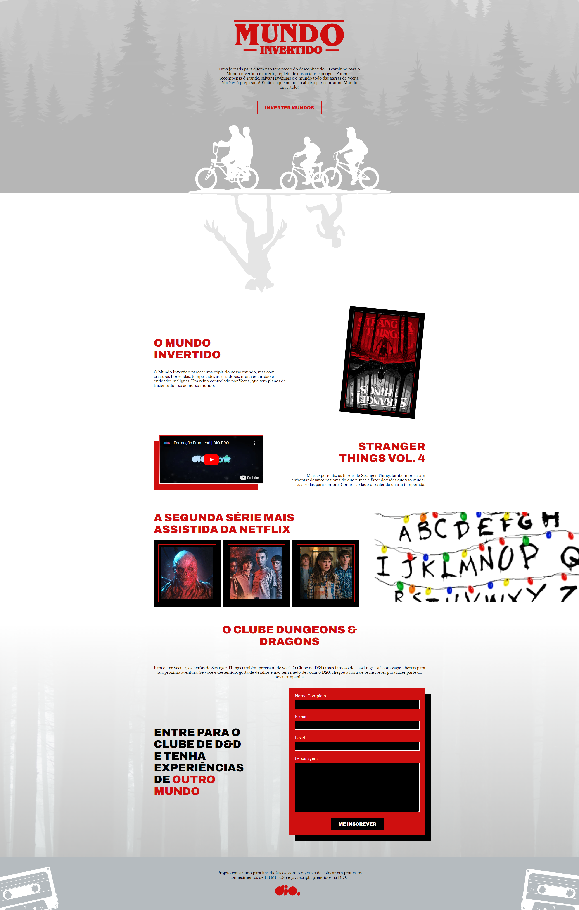
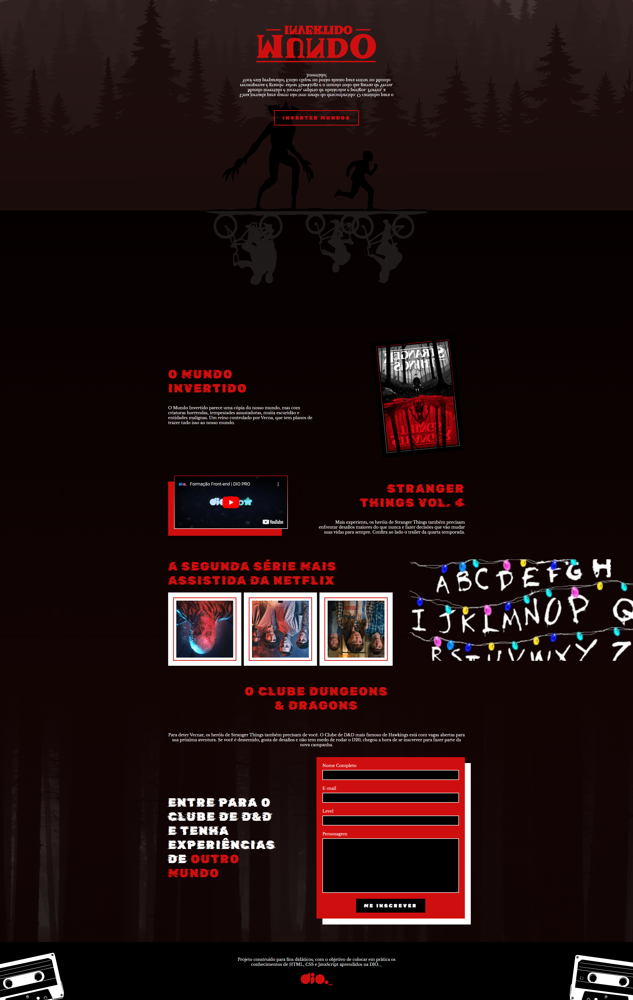

## Light Mode

<h1 align="center">
    
</h1>

 

## Dark Mode

<h1 align="center">
    
</h1>

## ⚙️ Tecnologias

Este projeto foi desenvolvido utilizando:

- [HTML](https://developer.mozilla.org/pt-BR/docs/Web/HTML)
- [CSS](https://developer.mozilla.org/pt-BR/docs/Web/CSS)
- [JavaScript](https://developer.mozilla.org/pt-BR/docs/Web/JavaScript)
- [Firebase](https://firebase.google.com/?hl=pt)

## 🖼️ Inspiração

- [DIO](https://www.dio.me/)

Projeto feito do dia 23 a 25/08/2022 na semana Front-end. No qual foi construido do zero um projeto com animações e theme switcher.

## Pendência

- Adicionar o formulário ao firebase.
